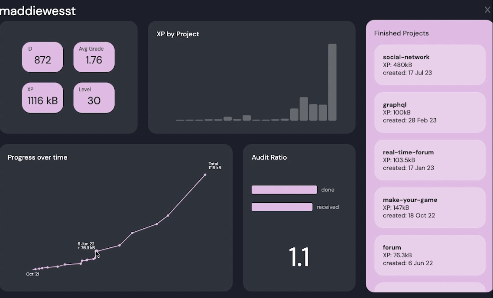

# Profile Page Project 

## Description

This project creates a profile page that displays user data queried from a GraphQL API. 

The profile page allows users to view their identification, XP amount, grades, audits, and statistics from the GraphQL API. Users must log in to access their data.
  
## Tools/Libraries

- GraphQL API
- JWT Authentication
- SVG for graphs 

## Usage

The login page requires a username and password. This is used to retrieve a JWT token for accessing the GraphQL API.

Once logged in, the profile page will display the user's data from the GraphQL endpoint.

Interactive SVG statistic graphs are generated from the user data.
